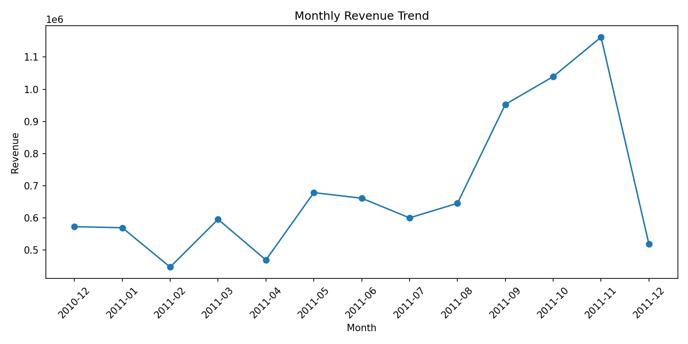
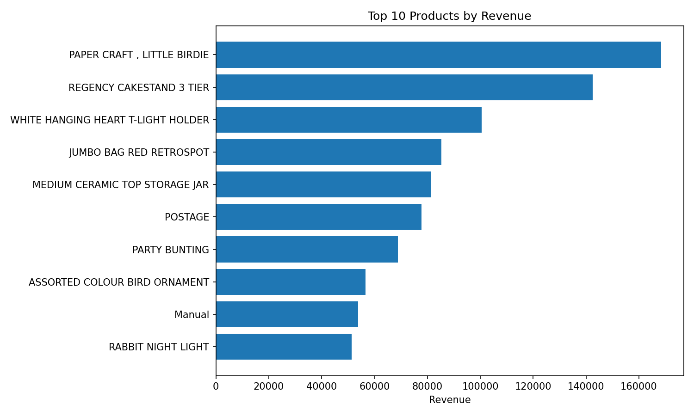
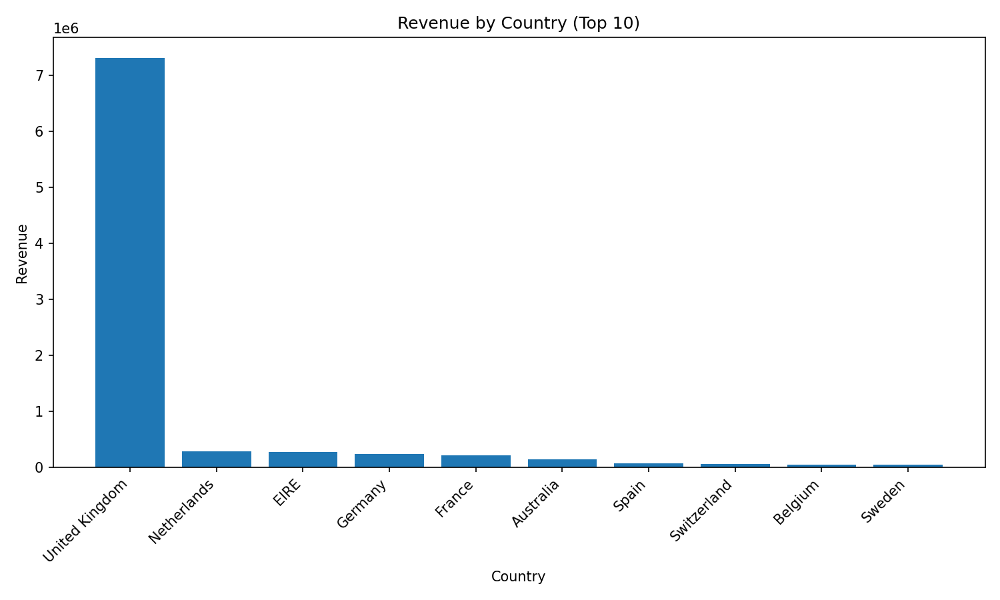
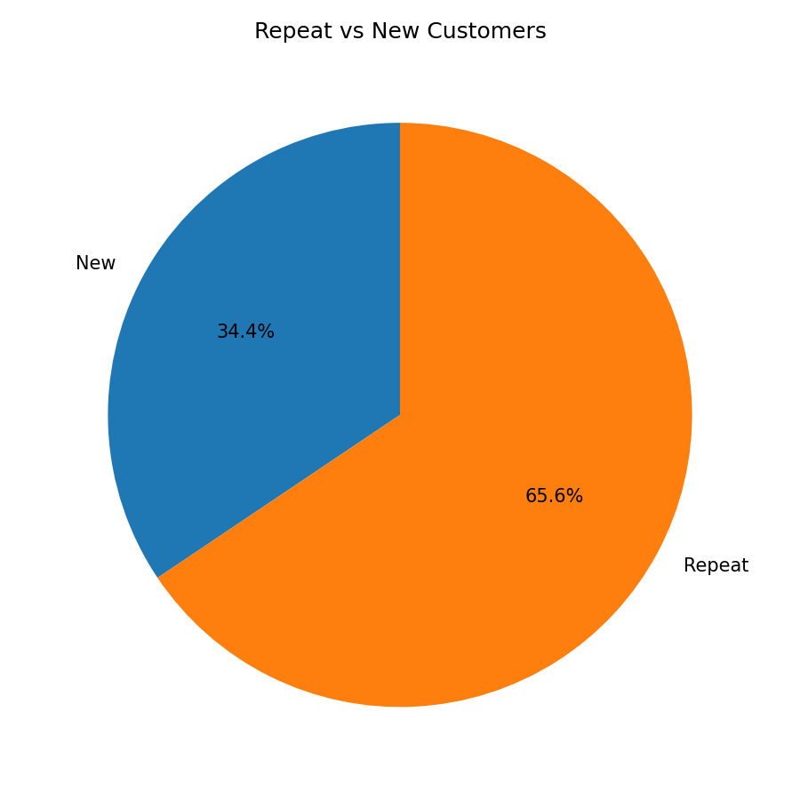

# 🛒 E-commerce Sales & Customer Analytics Project

A practical analytics project that transforms raw online retail transactions into **business-ready insights** using Python, SQL, and visual storytelling.

---

## 🎯 Objective
Build an end-to-end analytics workflow that helps a business quickly understand:
- How revenue is changing month by month
- Which products and countries drive the most sales
- How customer behavior impacts repeat purchases and long-term value

---

## 📊 Visual Insights (At a Glance)

### Monthly Revenue Trend


### Top 10 Products by Revenue


### Revenue by Country


### Repeat vs New Customers Distribution


---

## ✅ What We Achieved
- Cleaned and standardized retail transaction data
- Generated SQL-based business reports in CSV format
- Built visual dashboards for key KPIs
- Produced automated insight summaries for faster decision-making

---

## 🌟 Skills Highlighted
- **Data Cleaning & Preparation** (Pandas)
- **Business KPI Analysis** (Revenue, AOV, LTV, Repeat Rate)
- **SQL Analytics with SQLite**
- **Data Visualization** (Matplotlib)
- **Automated Insight Reporting**

---

## 🧰 Tech Stack
- Python 3
- SQL
- SQLite
- Pandas
- Matplotlib

---

## ▶️ How to Run
```bash
pip install -r requirements.txt
python main.py
```

---

## 🗂️ Dataset Description
Primary dataset: UCI **Online Retail** (`online_retail.xlsx` / `Online Retail.xlsx`).

If dataset download/loading fails, the pipeline can generate a realistic synthetic fallback dataset with the same schema.

Expected columns:
- InvoiceNo
- StockCode
- Description
- Quantity
- InvoiceDate
- UnitPrice
- CustomerID
- Country

---

## ❓ Business Questions Answered
1. What is the monthly revenue trend?
2. Which are the top 10 products by revenue?
3. Which countries generate the most revenue?
4. What is the split between repeat and new customers?
5. What is the average order value?
6. Who are the top customers by lifetime value?

---

## 📁 Outputs Generated
- Cleaned dataset: `data/processed/cleaned.csv`
- SQLite database: `data/processed/ecommerce.db`
- SQL query outputs: `output/tables/*.csv`
- Charts: `output/charts/*.png`
- Insights summary: `output/insights.txt`

---

## 📝 Example Insights (Auto-Generated)
- Total revenue: `<auto-filled by main.py>`
- Best month: `<auto-filled by main.py>`
- Top country: `<auto-filled by main.py>`
- Repeat customer percentage: `<auto-filled by main.py>`
- Average order value: `<auto-filled by main.py>`
- Top product category: `<auto-filled by main.py>`
